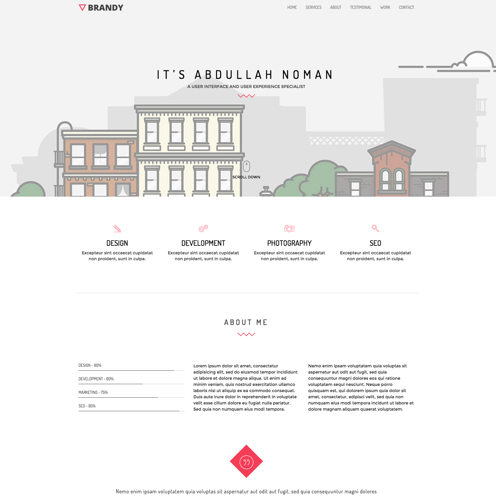

# jeromegraves.com

Source for my personal portfolio site, <https://jeromegraves.com>, hosted on GitHub Pages.
A plain static site (HTML / CSS / JavaScript) with no build step.



## Local preview

Serve the folder with any static file server, for example:

```bash
python -m http.server 8000
# then open http://localhost:8000
```

## Structure

| Path | Contents |
| --- | --- |
| `index.html` | Page markup |
| `style.css`, `css/` | Styles |
| `js/` | Scripts |
| `assets/`, `images/`, `fonts/` | Static assets |

## License

Code released under the MIT License ([`LICENSE`](LICENSE)). Content and images © Jerome Graves.
